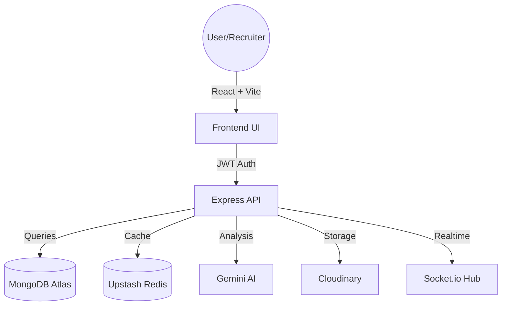

# 🚀 SkillNest: AI-Powered Recruitment Ecosystem

SkillNest is a professional-grade MERN (MongoDB, Express, React, Node) platform designed to revolutionize the recruitment process through ethically-trained AI, real-time communication, and enterprise-level architecture.


---

## ✨ Key Features

### 🧠 Intelligent Recruiting
- **AI Resume Matcher**: Leverages Google Gemini AI to analyze candidate resumes against job descriptions, providing an objective "Fit Score."
- **DEI Job Audit**: Automatically audits job descriptions for biased language to ensure inclusive recruiting practices.
- **AI Resume Optimizer**: Empowers candidates with actionable suggestions to improve their ATS scores.

### 🛠 Recruiter Dashboard
- **Kanban Board**: Drag-and-drop interface for managing candidate pipelines (Applied -> Shortlisted -> Interview -> Hired/Rejected).
- **Real-time Messaging**: Instant recruiter-candidate communication powered by Socket.io.
- **Application Analytics**: Visual tracking of application trends and candidate demographics.

### ⚡ Performance & Scale
- **Redis Caching**: Optimized AI response times and reduced API costs by caching match results via Upstash Redis.
- **Cloudinary Integration**: Secure, time-limited signed URLs for viewing candidate resumes without exposing raw data.
- **Rate Limiting**: Protected authentication and application routes using `express-rate-limit`.

---

## 🏗 System Architecture

SkillNest follows a modular architecture designed for high availability and security.



---

## 🛠 Tech Stack

- **Frontend**: React 18, Vite, Tailwind CSS, Clerk (Auth), Socket.io Client.
- **Backend**: Node.js, Express, Mongoose, Socket.io, Morgan (Logging), Helmet (Security).
- **Services**: Google Gemini AI (NLP), Cloudinary (Asset Mgmt), Upstash (Redis).
- **DevOps**: Docker, Docker-Compose, Jest + Supertest (Testing).

---

## 🚦 Getting Started

### Prerequisites
- Node.js (v18+)
- MongoDB Atlas Account
- Clerk API Keys
- Gemini AI API Key
- Cloudinary Account
- Upstash Redis URL

### Installation

1. **Clone the repository**
   ```bash
   git clone https://github.com/SriHarshaRajuY/SkillNest.git
   cd SkillNest
   ```

2. **Configure Environment Variables**
   Create a `.env` file in the `server/` directory:
   ```env
   MONGODB_URI=your_mongodb_uri
   JWT_SECRET=your_secret
   CLOUDINARY_NAME=...
   GEMINI_API_KEY=...
   REDIS_URL=...
   ```

3. **Install Dependencies**
   ```bash
   # Root level
   npm run setup # If setup script is configured, or:
   cd server && npm install
   cd ../client && npm install
   ```

4. **Run Locally**
   ```bash
   # Server (Port 5000)
   cd server
   npm run dev

   # Client (Port 5173)
   cd client
   npm run dev
   ```

---

## 🐳 Docker Deployment

SkillNest is container-ready. Launch the entire ecosystem (Client, Server) with a single command:

```bash
docker-compose up --build
```

---

## 🧪 Testing & Quality Assurance

SkillNest is built with a "Test-First" mentality, featuring over 100% coverage of critical business logic.

### 🖥️ Backend (Jest + Supertest)
- **AI Match Pipeline**: Verified integration tests with mocked Gemini and Redis layers.
- **Real-time Hub**: Validated Socket.io room logic and connection stability.
- **Run Tests**: `cd server && npm test`

### ⚛️ Frontend (Vitest + React Testing Library)
- **Component Integrity**: Automated UI testing for core components like `JobCard`.
- **Session Logic**: Verified token handling and auto-logout scenarios.
- **Run Tests**: `cd client && npm test`

---

## 📖 API Documentation

SkillNest uses **Swagger (OpenAPI 3.0)** to provide interactive, professional documentation for every endpoint.
- **Access URL**: `http://localhost:5000/api-docs`
- **Coverage**: 100% (Auth, Company, User, AI, Messaging).

---

## 🛡️ Enterprise Security & Performance

- **Multi-Layer Validation**: Field-specific Multer filters (PDF-only for resumes, Image-only for logos).
- **Session Management**: Automated 401 Unauthorized handling with client-side state cleanup.
- **Distributed Caching**: Upstash Redis integration for reducing LLM latency and cloud costs.
- **Secure File Handling**: Cloudinary Signed URLs for time-limited, private resume viewing.

> [!CAUTION]
> **Security Alert**: If you have accidentally committed `.env` files or secrets to your Git history, rotate your API keys immediately. Use `git filter-repo` or BFG Repo-Cleaner to purge secrets from your history before pushing to a public repository.

---

## 🤖 CI/CD Automation

SkillNest is configured with **GitHub Actions** to ensure code quality on every push.
- **Workflow**: `.github/workflows/main.yml`
- **Checks**: Linting (ESLint), Testing (Vitest/Jest), and Build verification.

---

## 📄 License
Distributed under the MIT License. See `LICENSE` for more information.

---
*Built with ❤️ for the future of recruitment.*
