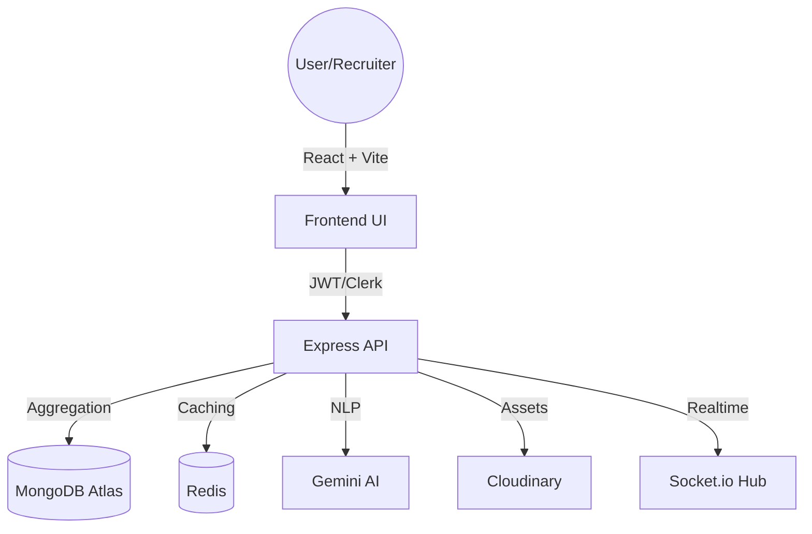

# SkillNest: AI-Assisted Recruitment Platform

SkillNest is a full-stack MERN platform built with a focus on robust backend engineering, clean architecture, and realistic recruitment workflows. It leverages Google Gemini AI for resume matching and real-time communication via Socket.io, providing a polished and scalable foundation for internship/SDE candidate evaluation.

---

## 🛠 Core Features

### 🧠 AI Integration (Gemini AI)
- **Automated Resume Matching**: Analyzes candidate resumes against job descriptions using Google Gemini Pro, generating a match score and technical reasoning.
- **Reliability Layer**: Implemented timeout handling, defensive JSON parsing, and exponential backoff retries to ensure AI service stability.
- **Redis Caching**: Frequently accessed match results are cached in Redis to reduce LLM latency and API costs.

### 📊 Recruiter Pipeline Management
- **Workflow Management**: Real-time pipeline updates (Applied, Screening, Interview, Offer, Rejected) with automatic candidate notification.
- **Internal Notes**: Recruiters can add private feedback and ratings to applications, synced in real-time across the hiring team.
- **Job Lifecycle**: Full control over job posting, visibility toggling, and applicant tracking.

### 💬 Real-time Messaging
- **Instant Communication**: Socket.io-based chat between recruiters and candidates.
- **Room Isolation**: Strict authorization-based room joining to ensure data privacy.
- **Unread Sync**: Real-time unread message counters for both candidates and recruiters.

---

## 🏗 System Architecture

SkillNest is built as a modular monolith, prioritizing simplicity and maintainability over overengineered microservices.



---

## ⚡ Technical Highlights

- **Database Optimization**: Implemented compound indexing and `.lean()` queries to ensure sub-100ms response times for data-heavy listing operations.
- **Validation Layer**: Centralized request validation using **Joi**, ensuring data integrity and sanitization across all API boundaries.
- **Structured Logging**: Replaced scattered console logs with a centralized, level-based logger for better observability.
- **Security**: 
  - **Clerk Auth**: Secure candidate authentication.
  - **JWT Auth**: Independent recruiter authentication.
  - **Signed URLs**: Resumes are served via time-limited Cloudinary signed URLs.
- **Pagination & Filtering**: Efficient server-side pagination and complex filtering for jobs and applications.

---

## 🚀 Tech Stack

- **Frontend**: React 18, Vite, Tailwind CSS, Clerk (User Auth), Socket.io Client.
- **Backend**: Node.js, Express, Mongoose, Socket.io, Joi (Validation), Winston (Logging).
- **Services**: Google Gemini AI, Cloudinary (Storage), Upstash/Redis (Cache).
- **Testing**: Jest + Supertest (Integration), Vitest (UI).

---

## 🚦 Getting Started

### Prerequisites
- Node.js (v18+)
- MongoDB Atlas Account
- Clerk Account (Frontend Auth)
- Gemini AI API Key
- Cloudinary Account
- Redis Instance (Local or Upstash)

### Installation

1. **Clone the repository**
   ```bash
   git clone https://github.com/SriHarshaRajuY/SkillNest.git
   cd SkillNest
   ```

2. **Backend Configuration**
   In `server/.env`:
   ```env
   MONGODB_URI=...
   JWT_SECRET=...
   GEMINI_API_KEY=...
   REDIS_URL=...
   CLOUDINARY_URL=...
   ```

3. **Frontend Configuration**
   In `client/.env`:
   ```env
   VITE_CLERK_PUBLISHABLE_KEY=...
   VITE_BACKEND_URL=http://localhost:5000
   ```

4. **Run the Project**
   ```bash
   # Terminal 1: Backend
   cd server && npm install && npm run dev

   # Terminal 2: Frontend
   cd client && npm install && npm run dev
   ```

---

## 🧪 Quality Assurance

- **Integration Tests**: `cd server && npm test` (Covers AI flow, Authentication, and Database operations).
- **Frontend Tests**: `cd client && npm test` (Covers UI component integrity).

---

## 📄 License
Distributed under the MIT License.
